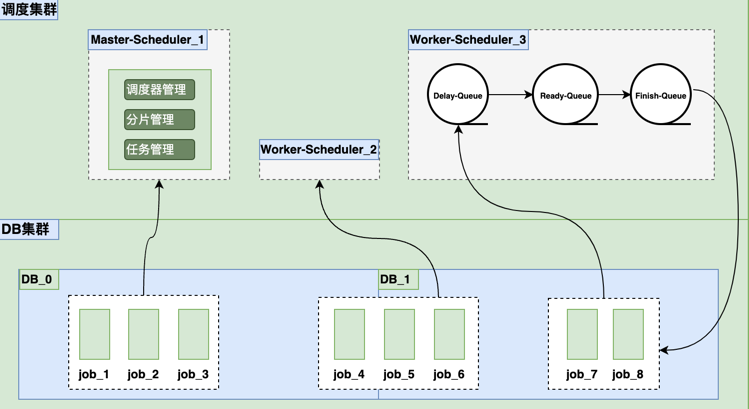
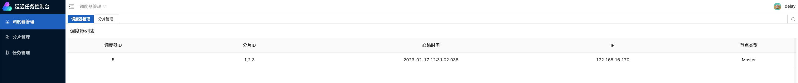
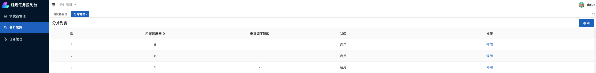
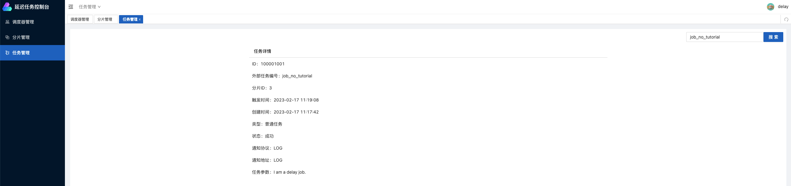

<h1 align="center">

</h1>
<h1 align="center">
    Delay-Job,high-performance distributed lightweight delay scheduling middleware
</h1>
<p align="center">
    
    
    
    
    
    
</p>

English | [简体中文](./readme.zh-CN.md)

### Use Cases
* 🐯 How to close the order in time if the order has not been paid after a period of time?
* 🦁️ How to remind the user that the information has not been completed after a period of time after registration?

The scene where the user triggers a specific event and expects to deal with it after a period of delay is the place to delay the task scheduling application

### Feature
* 🚀 Custom delay scheduling time
* 🔔 Task pause
* 🔥 Task Sharding
* ⚡ Visual management task sharding
* ✨ Visual management of delayed tasks
* 🔧 Rapid deployment

### Architecture

### Performance Index
* Second-level trigger: Second-level precise scheduling 50000 times/s
* Test resources: CentOS7.9, 2CPU, 4GB Ram

### Quick start
Required
* Java 1.8+
* Mysql 5.7+ 
#### 1. Download the binary package
  
Use the following command to download the binary package 
```
wget https://github.com/findthinks/delay-job/releases/download/0.6.1/delay-job-bin-0.6.1.zip
unzip delay-job-bin-v0.6.1.zip
```
#### 2. Create database
exec docs/db/schema_init.sql for creatting database, table and init data.
#### 3. Start the scheduling service
Enter the "config" directory, and modify the "application.yml" database related configuration according to the actual situation. Enter the "bin" directory, use the "startup.sh" script to start the service. Check whether the "log/delay-job.log" service starts successfully.
```
cd delay-job/bin
./startup.sh
```
#### 4. Add delay job
```
curl -X 'POST' 'http://localhost:1989/api/v1/submit/job' \
  -H 'Content-Type:application/json' \
  -d'{
      "outJobNo":"first_delay_job",
      "triggerTime":1676608523,
      "callbackProtocol":"LOG",
      "callbackEndpoint":"LOG",
      "jobInfo":"I am a delay job."
    }'
```
> Tips：callbackProtocol、callbackEndpoint as "LOG" at the same time, which can be used for debugging. After the task is triggered, trigger information will be output in the dispatching console.
#### 5. Trigger notification
```
2023-02-17 12:35:23||Job-Executor-0||INFO||com.findthinks.delay.job.scheduler.EchoJobTrigger:15||Job[outJobNo:first_delay_job] trigger success, CurrentTime:1676608523, TriggerTime:1676608523, CreateTime:1676608438.
```

### Management UI
After the service starts successfully, visit："http://localhost:1989"，The default username and password are "delay/delay".

#### 1. Scheduler management
Delay-job adopts the task sharding scheduling architecture. Through the scheduler view of the management ui, you can query the currently deployed scheduler information.

#### 2. Shard management
Sharding information can be configured on the management interface to add, enable, and disable shards. It is recommended that the number of available shards be 2 to 4 times the total number of schedulers. By default, 3 shards are preset for the scheduling cluster, and each shard will be automatically balanced among multiple schedulers.

#### 3. Task management
The registered task information can be queried through the management interface, and the precise query of the task number is currently supported.


### Technical Integration

#### 1. Task
Task management includes task registration, task batch registration, task cancellation, task timing pause, and task timing interface.
* [HTTP](docs/http_job_register.md)
* [GRPC](src/main/resources/pb/Job.proto)，The client extracts the Job.proto file to generate task registration code and registers the delayed job.

> Tips：<br/>
> 1. Callback notifications can be freely selected, such as when registering tasks using HTTP or GRPC interfaces, any of HTTP, GRPC, or KAFKA can be selected as the callback notification method.
<br/>
> 2. The default port for GRPC calls is 1990.

#### 2. Callback
When the task trigger time is reached, the scheduling server will trigger a notification, which supports HTTP interface callback, GRPC interface callback, and KAFKA message notification.
* [HTTP](docs/http_job_callback.md): The client provides a POST callback interface to receive the callback request from the server.
* [GRPC](src/main/resources/pb/JobCallback.proto): The client extracts the JobCallback.proto file, publishes the callback GRPC interface, and receives the server callback request
* [KAFKA](docs/kafka_job_callback.md): The server sends the task trigger event message to Kafka, and the business end consumes the message and processes the delayed task.
### Version
#### 20223/2/14 - version 0.6.1

### Community

