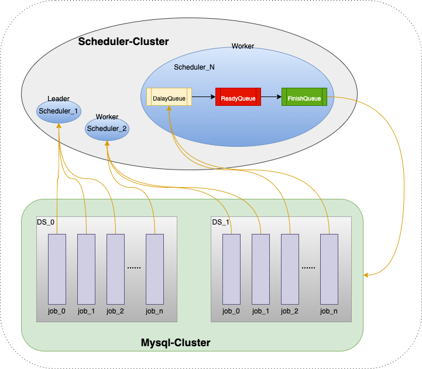

## 延迟调度服务

### 业务场景
* 订单超时未支付，如何及时关闭，恢复库存？
* 用户注册，超时未完善资料，如何及时提醒？

所有基于特定事件延迟一定时间后，要发起的操作，都是延迟调度的应用场景。

### 架构设计

* 任务分片：任务分库分表存放到数据库集群，每一张表定义为一个任务分片。
* Scheduler集群：
   1、Leader-Scheduler: 分配任务分片，分片任务的处理。
   2、Worker-Scheduler: 分片任务处理。

### 设计目标
1、精确调度，PC单机测试，精确调度25000次/秒。 
2、轻量级，服务只依赖数据库，易于部署使用。 
3、动态扩充调度能力，分布式分片，能通过动态增加任务分片，增加调度节点，快速扩展调度能力。

### 对接
##### GRPC接入
    1. 任务提交，提取src/main/resource/proto/DelayJob.proto文件，生成提交客户端。其中提供3个实现，submitJob，submitJobs，cancelJob，分别对应单个任务提交，批量任务提交，任务取消。
      单任务提交(submitJob): 
        outJobNo：外部任务编号，最大长度32位字符串。
        triggerTime：任务触发时间点，时间搓，单位毫秒。
        callbackProtocol: 回调协议：HTTP/GRPC。
        callbackEndpoint： 回调地址。
        jobInfo：任务信息，回调时透传，可使用json字符串。
      批量任务提交(submitJobs): 
        同单任务提交。
      任务取消(cancelJob): 
        outJobNo：外部任务编号。
    2. 接口地址
      a. 开发测试: delay-job.grpc.test.jgjapp.com:80
      b. 生产：delay-job-svc.jgj-app.svc.cluster.local:8080
    3. 回调，提取src/main/resource/proto/DelayJobCallback.proto，生成回调GRPC服务，注册任务时提供回调地址。
##### HTTP接入
    1.任务提交：
      POST: 单任务提交(/submit/job): 
        请求req:
          {
            "outJobNo":"jgj_delay",
            "triggerTime":1651904707000,
            "callbackProtocol":"HTTP",
            "callbackEndpoint":"http://localhost:1989/job/callback", #注册任务时提供回调地址
            "jobInfo":"{'test':'i am a delay job.'}"
          }
        响应resp:
          {
            "code": 0, #业务状态码0，代表任务创建成功。
            "msg": "OK"
          }
      POST: 批量任务提交：/submit/jobs
        请求req:
          [
            {
              "outJobNo":"jgj_delay",
              "triggerTime":1651904707000,
              "callbackProtocol":"HTTP",
              "callbackEndpoint":"http://localhost:1989/job/callback",
              "jobInfo":"{'test':'i am a jgj delay job.'}"
            },
            {
              "outJobNo":"jgb_delay",
              "triggerTime":1651904707000,
              "callbackProtocol":"HTTP",
              "callbackEndpoint":"http://localhost:1989/job/callback",
              "jobInfo":"{'test':'i am a jgb delay job.'}"
            }
          ]
        响应resp:
          {
            "code": 0,
            "msg": "OK"
          }
      POST: 任务取消: /cancel/job
        请求req:
          {
            "outJobNo":"jgj_delay",
          }
        响应resp:
          {
            "code": 0,
            "msg": "OK"
          }
    2. 回调
      POST: 地址客户端注册任务时提供提供。
        请求req:
          {
            "outJobNo":"jgj_delay",
            "triggerTime":1651904707000,
            "jobInfo":"{'test':'i am a delay job.'}"
          }
        响应resp:
          {
            "code": 0,  # 标识回调成功。
            "msg": "OK"
          }
> 1、HTTP/GRPC注册的任务，可使用交叉协议回调，例如HTTP注册的任务，可以回调GRPC地址； 
> 2、不要在回调中处理过多的阻塞业务，如果需要，请使用线程、协程池做任务异步处理，应保证回调快速响应服务端，减少阻塞服务端调度。

### 后期规划
  1、回调增加订阅方式。