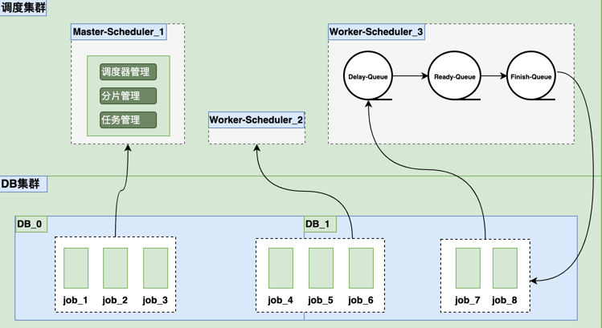

## Delay-job 延迟任务调度系统
Delay-job是一个开源分布式、轻量级的延迟任务调度实现。

### 特性
* 支持特定事件发生后，延迟一定时间后触发调度
* 支持分布式分片任务调度
* 支持可视化管理任务分片
* 支持可视化管理延迟任务 
* 快速部署(只依赖Mysql)

### 架构

### 性能
* 秒级触发：秒级精确调度50000次/s
* 测试资源：CentOS7.9，2CPU，4GB Ram运行于腾讯云虚拟机

### 服务端部署
#### 1. 下载部署包
使用如下命令下载最新发布的系统的部署包。
```
wget https://github.com/**********/download/delay-job-bin-v0.6.1.zip
unzip delay-job-bin-v0.6.1.zip
```
#### 2. 创建数据库
提取docs/db/schema_init.sql执行建库，建表，数据初始化。
#### 3. 启动调度服务端
进入解压目录config目录，按实修改application.yml数据库相关配置。进入解压目录bin目录，使用startup.sh脚本启动服务。观察log/delay-job.log服务是否启动成功。
```
cd delay-job
./startup.sh
```

### 客户端接入
#### [1. HTTP客户端接入](docs/http_client.md)
### 版本
#### 2022/10/22 - version 0.6.1
第一个试用版本。