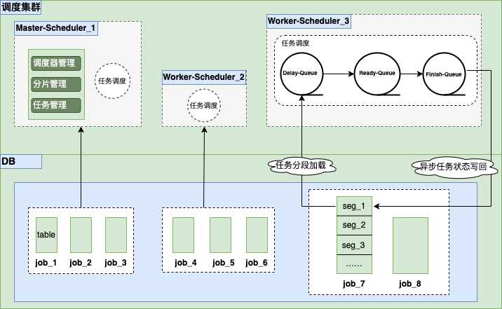

## Delay-job 延迟任务调度系统
Delay-job是一个开源分布式、轻量级的延迟任务调度实现。

### 背景
* 订单创建一段时间后未支付，如何及时的关闭订单？
* 用户注册一段时间后未完善资料，如何及时提醒？

用户触发了特定事件，期望延迟一段时间后，做出相应处理的场景，都是延迟任务调度应用的地方。

### 特性
* 支持特定事件发生后，延迟一定时间后触发调度
* 支持分布式分片任务调度
* 支持可视化管理任务分片
* 支持可视化管理延迟任务
* 快速部署(只依赖Mysql)

### 架构

### 性能
* 秒级触发：秒级精确调度50000次/s
* 测试资源：CentOS7.9，2CPU，4GB Ram运行于腾讯云虚拟机

### 服务端部署
#### 1. 下载部署包
使用如下命令下载最新发布的系统的部署包。
```
wget https://github.com/findthinks/delay-job/releases/download/0.6.1/delay-job-bin-0.6.1.zip
unzip delay-job-bin-v0.6.1.zip
```
#### 2. 创建数据库
提取docs/db/schema_init.sql执行建库，建表，数据初始化。
#### 3. 启动调度服务端
进入解压目录config目录，按实修改application.yml数据库相关配置。进入解压目录bin目录，使用startup.sh脚本启动服务。观察log/delay-job.log服务是否启动成功。
```
cd delay-job/bin
./startup.sh
```
#### 4. 管理界面配置
服务端启动后，需进入管理界面配置分片信息。如图为调度系统创建任务分片，推荐可用分片数量为调度器总数的2~4倍。本项目默认支持分布式集群，各分片会在多个调度器中自动均衡分配。


> 注：本地启动服务后，管理界面访问地址为：http://localhost:1989，默认账号密码为delay/delay。

### 任务管理
任务管理包括任务注册，任务批量注册，任务取消，暂停任务计时，恢复任务计时接口。
* [HTTP客户端接入](docs/http_job_register.md)
* [GRPC客户端接入](src/main/resources/pb/Job.proto)，客户端提取Job.proto文件生成任务注册代码，注册延迟任务。

> 注：<br/>
> 1、回调通知可以自由选择，如使用HTTP或者GRPC接口注册任务时，可以选择HTTP、GRPC、KAFKA中的任一种作为回调通知的方式。<br/>
> 2、默认本地GRPC任务管理接口发布地址为：localhost:1990

### 触发通知
到达任务触发时间，调度服务端会触发一个通知，支持HTTP接口回调，GRPC接口回调，KAFKA消息通知三种方式。
* [HTTP通知](docs/http_job_callback.md)，客户端提供POST回调接口，接收服务端回调请求。
* [GRPC通知](src/main/resources/pb/JobCallback.proto)，客户端提取JobCallback.proto文件，发布回调GRPC接口，接收服务端回调请求。
* [KAFKA通知](docs/kafka_job_callback.md)，服务端将任务触发事件消息投递到Kafka，业务端消费消息，处理延迟任务。
### 版本
#### 2022/10/22 - version 0.6.1
第一个试用版本。

### 微信交流
